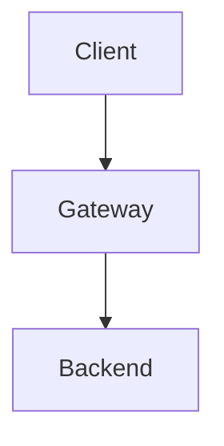

# Caption Format Vietnamese — template + ví dụ

## 1. Format chuẩn

```markdown
**Hình N.M: <mô tả tiếng Việt>**
```

Hoặc cho table:

```markdown
**Bảng N.M: <mô tả tiếng Việt>**
```

## 2. Rules

- **Bold** wrapper `**...**` (Markdown bold)
- Tiền tố `Hình` (cho figure / diagram / screenshot) hoặc `Bảng` (cho table)
- Numbering `N.M` — N = chapter (1-9), M = sequential trong chapter (restart per chapter)
- Description tiếng Việt natural, ≤15 từ, 1 câu duy nhất
- KHÔNG đặt dấu chấm `.` cuối nếu caption ngắn ≤10 từ
- KHÔNG đặt period nhưng OK đặt nguồn / context trong dấu ngoặc cuối: `(Capture từ /admin dashboard ngày DD/MM/YYYY)`
- **Vị trí:** BÊN DƯỚI figure / table, KHÔNG bên trên
- English technical token OK natural: `JWT`, `OAuth`, `Mermaid`, `PlantUML`
- Khi render Word: italic + font 11pt (vs body 13pt) — auto-detect bằng markdown `**...**` style

## 3. Ví dụ

### ✅ Tốt

```markdown
**Hình 2.3: Kiến trúc đa tenant của hệ thống với gateway routing theo subdomain**

**Hình 3.1: Sequence diagram cho luồng JWT authentication từ login đến refresh token**

**Hình 4.2: Dashboard CloudWatch hiển thị p95 latency 7 ngày qua**

**Hình 1.5: So sánh chi phí AWS EC2 vs vendor-X cho giai đoạn BETA** *(Nguồn: AWS Cost Explorer DD/MM/YYYY)*

**Bảng 2.1: Ma trận tính năng hệ thống vs sản phẩm cạnh tranh A vs sản phẩm cạnh tranh B**

**Bảng 3.4: Cấu hình mặc định cho Spring Boot profile `production`**

**Hình 4.6: Workflow CI/CD pipeline qua GitHub Actions**
```

### ❌ Anti-pattern

```markdown
❌ "Hình 2.3" (thiếu mô tả)
❌ "Figure 2.3: Multi-tenant architecture..." (English thay vì tiếng Việt)
❌ "**Hình 2.3:** Kiến trúc..." (italic prefix riêng, không full bold)
❌ "*Hình 2.3*: Kiến trúc..." (italic Markdown, không bold)
❌ "Hình 2-3: ..." (dùng `-` thay vì `.` cho numbering)
❌ "Hình 23: ..." (continuous numbering across chapters, không restart)
❌ "Hình 2.3: ..." đặt BÊN TRÊN figure (sai vị trí)
❌ "Hình 2.3: Sequence diagram cho luồng JWT authentication từ login đến refresh token sau khi user click button đăng nhập trên homepage và backend issue access token." (quá dài >15 từ)
❌ "Hình 2.3: Mô tả." (description quá vague)
❌ "Hình 2.3: Sơ đồ" (description chỉ 1 từ, không đủ context)
```

## 4. Caption cho code listing

Nếu code snippet >20 dòng → treat as figure với prefix `Listing N.M`:

```markdown
```java
@RestController
@RequestMapping("/api/v1/admin")
public class AdminController {
    // ... 25+ lines ...
}
```

**Listing 3.2: AdminController với role-based access control cho tenant admin endpoints**
```

## 5. Caption cho Mermaid block

Caption đứng NGAY DƯỚI fence ``` đóng (không phải trong fence):

````markdown


**Hình 2.4: Luồng request từ client qua gateway đến backend hệ thống**
````

## 6. Persona-specific tone (cho thesis context)

Thesis là academic deliverable — tone formal, không casual:

| ❌ Casual (BANNED in thesis) | ✅ Formal (REQUIRED) |
|---|---|
| `Hình 2.3: Cái này show kiến trúc` | `Hình 2.3: Kiến trúc đa tenant của hệ thống` |
| `Bảng 1.1: So sánh các bro vendor` | `Bảng 1.1: So sánh các giải pháp cạnh tranh trên thị trường` |
| `Hình 4.5: Awesome dashboard 🚀` | `Hình 4.5: Dashboard giám sát hiệu năng hệ thống` |

KHÔNG dùng emoji trong caption. KHÔNG dùng từ "đối thủ" (per `thesis-content-standard.md` C4 academic tone) — dùng "giải pháp cạnh tranh" / "các sản phẩm tương tự".

## 7. Citation trong body text

Khi reference figure, dùng phrase chuẩn:

- `Như trình bày trong Hình N.M, ...`
- `Hình N.M minh hoạ ...`
- `Xem Hình N.M để biết chi tiết.`
- `Bảng N.M liệt kê ...`
- `(xem Hình N.M)` — inline parenthetical

KHÔNG dùng:
- ❌ `Cái hình ở trên` (vague)
- ❌ `Figure 2.3` (English)
- ❌ `Hinh 2.3` (thiếu dấu)
